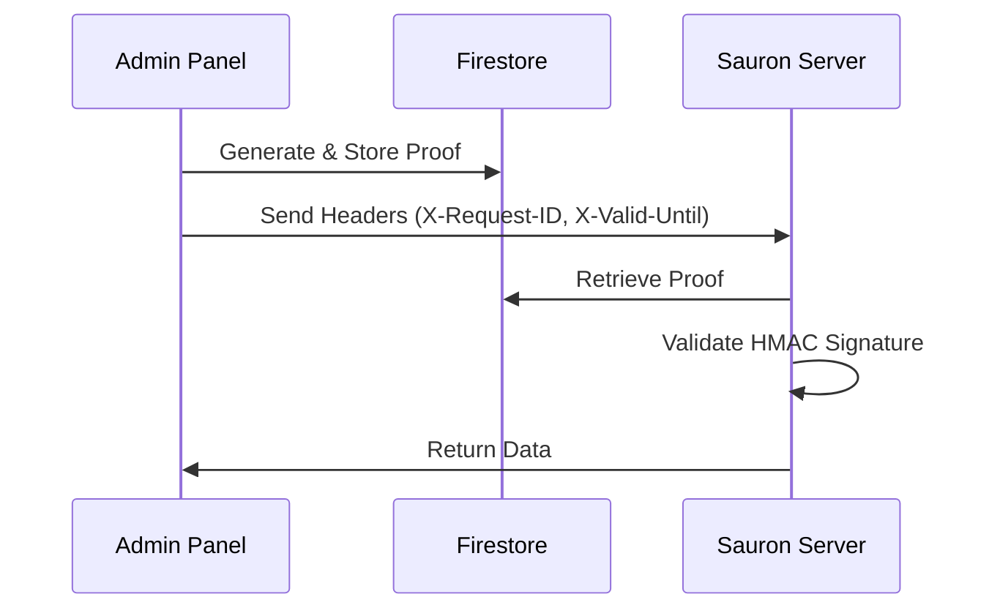

# Firestore-Witnessed Authentication System

## Overview

Sauron Pro implements a sophisticated **Firestore-witnessed authentication system** that replaces static admin keys with time-limited cryptographic proofs. This provides enhanced security by ensuring admin credentials are never transmitted over the network.

## How It Works

### 1. Authentication Flow



### 2. Proof Generation

The admin panel generates a cryptographic proof using:

```typescript
// HMAC-SHA256 signature calculation
const payload = `${requestId}:${userAgent}:${clientIP}:${validUntil}:${createdAt}`;
const signature = crypto
  .createHmac('sha256', adminKey)
  .update(payload)
  .digest('hex');
```

### 3. Firestore Storage

Each proof is stored in Firestore with the following structure:

```json
{
  "request_id": "a35905f9c363f8be3e297a5b59d8cf29",
  "proof": "3e69289a81eb9ef8774df5a5bfdef287ff8549c57614a5a3afd1a85dd4e17487",
  "valid_until": 1755734576,
  "created_at": 1755648976,
  "user_agent": "NextJS-Admin-Panel/1.0",
  "client_ip": "::1",
  "proof_type": "admin_auth"
}
```

## Authentication Headers

### New Method (Recommended)

Use Firestore-witnessed authentication headers:

```bash
curl -k -X GET https://localhost:443/admin/metrics \
  -H "X-Request-ID: a35905f9c363f8be3e297a5b59d8cf29" \
  -H "X-Valid-Until: 1755734576" \
  -H "Content-Type: application/json"
```

### Legacy Method (Fallback)

Static admin key authentication (deprecated but supported):

```bash
curl -k -X GET https://localhost:443/admin/metrics \
  -H "X-Admin-Key: your_admin_key_here" \
  -H "Content-Type: application/json"
```

## Security Features

### ✅ **Enhanced Security**

- **No Key Transmission**: Admin keys never leave the secure environment
- **Time-Limited Proofs**: Each proof expires in 24 hours
- **Cryptographic Validation**: HMAC-SHA256 signatures prevent tampering
- **Replay Protection**: Each proof has a unique request ID

### ✅ **Performance Optimization**

- **24-Hour Caching**: Proofs are cached to reduce Firestore reads
- **Automatic Cleanup**: Expired proofs are automatically removed
- **Fallback Support**: Graceful degradation to admin key if needed

### ✅ **Audit Trail**

- **Complete Logging**: All authentication attempts are logged
- **Firestore History**: Proof generation and usage tracked
- **IP and User-Agent**: Additional context for security monitoring

## Implementation Examples

### TypeScript/Next.js

```typescript
import { getAuthManager } from '@/lib/authManager';

// Generate authentication proof
const authManager = getAuthManager();
const proof = await authManager.generateAuthProof();

// Use authenticated fetch
const response = await authenticatedFetch('/admin/metrics', {
  method: 'GET'
});
```

### cURL Examples

```bash
# Step 1: Generate proof (via admin panel)
curl -s "http://localhost:3000/api/auth/proof" | jq .

# Step 2: Use the returned headers
curl -k -X GET https://localhost:443/admin/metrics \
  -H "X-Request-ID: [request_id_from_step_1]" \
  -H "X-Valid-Until: [timestamp_from_step_1]"
```

### Python Example

```python
import requests
import hmac
import hashlib
import secrets
import time

def generate_auth_proof(admin_key, user_agent="Python-Client/1.0"):
    request_id = secrets.token_hex(16)
    valid_until = int(time.time()) + (24 * 60 * 60)  # 24 hours
    created_at = int(time.time())
    client_ip = "127.0.0.1"
    
    # Create HMAC signature
    payload = f"{request_id}:{user_agent}:{client_ip}:{valid_until}:{created_at}"
    signature = hmac.new(
        admin_key.encode('utf-8'),
        payload.encode('utf-8'),
        hashlib.sha256
    ).hexdigest()
    
    # Store in Firestore (you'll need to implement this)
    # store_proof_in_firestore(request_id, signature, valid_until, created_at, user_agent, client_ip)
    
    return {
        "X-Request-ID": request_id,
        "X-Valid-Until": str(valid_until)
    }

# Usage
headers = generate_auth_proof("your_admin_key_here")
response = requests.get("https://localhost:443/admin/metrics", 
                       headers=headers, verify=False)
```

## Troubleshooting

### Common Issues

1. **"Invalid Firestore Authentication"**
   - Check that proof exists in Firestore
   - Verify HMAC signature calculation
   - Ensure timestamps are in Unix seconds (not milliseconds)

2. **"Auth proof expired"**
   - Generate a new proof (they expire after 24 hours)
   - Check system clock synchronization

3. **SSL Certificate Errors**
   - Use `-k` flag with curl for local development
   - Set `NODE_TLS_REJECT_UNAUTHORIZED=0` for Node.js clients

### Debug Information

Enable debug logging to see authentication flow:

```bash
# Check Sauron server logs
tail -f logs/system.log | grep -E "(auth|firestore)"

# Check admin panel logs
# Browser Developer Tools → Console
```

## Migration Guide

### From Static Admin Keys

1. **Update your client code** to use the new authentication headers
2. **Test both methods** work during transition period
3. **Monitor logs** for successful Firestore authentication
4. **Remove admin key** usage once fully migrated

### API Client Updates

Replace this:

```bash
curl -H "X-Admin-Key: your_key" https://localhost:443/admin/metrics
```

With this:

```bash
# Generate proof first
PROOF=$(curl -s "http://localhost:3000/api/auth/proof" | jq -r '.usage.headers')
REQUEST_ID=$(echo $PROOF | jq -r '."X-Request-ID"')
VALID_UNTIL=$(echo $PROOF | jq -r '."X-Valid-Until"')

# Use proof for authentication
curl -H "X-Request-ID: $REQUEST_ID" -H "X-Valid-Until: $VALID_UNTIL" \
     https://localhost:443/admin/metrics
```

## Best Practices

1. **Cache Proofs**: Reuse proofs for up to 24 hours to reduce Firestore load
2. **Handle Expiration**: Implement automatic proof regeneration
3. **Monitor Usage**: Track proof generation and validation in logs
4. **Secure Storage**: Keep admin keys secure in environment variables
5. **Network Security**: Always use HTTPS in production environments

## API Endpoints

### Generate Authentication Proof

```http
GET /api/auth/proof
```

**Response:**

```json
{
  "success": true,
  "requestId": "a35905f9c363f8be3e297a5b59d8cf29",
  "validUntil": "2025-08-21T00:02:56.000Z",
  "validUntilTimestamp": 1755734576000,
  "signature": "3e69289a81eb9ef8774df5a5bfdef287ff8549c57614a5a3afd1a85dd4e17487",
  "message": "Authentication proof generated and stored in Firestore",
  "usage": {
    "headers": {
      "X-Request-ID": "a35905f9c363f8be3e297a5b59d8cf29",
      "X-Valid-Until": "1755734576000"
    },
    "note": "Use these headers instead of X-Admin-Key for API calls"
  }
}
```

### Get Authentication Statistics

```http
POST /api/auth/proof
```

**Response:**

```json
{
  "success": true,
  "currentAuth": {
    "headers": {
      "X-Request-ID": "a35905f9c363f8be3e297a5b59d8cf29",
      "X-Valid-Until": "1755734576000",
      "Content-Type": "application/json"
    },
    "message": "Current authentication headers (cached or newly generated)"
  }
}
```

---

**Note**: This authentication system represents a significant security enhancement over static admin keys and is the recommended method for all new integrations.
